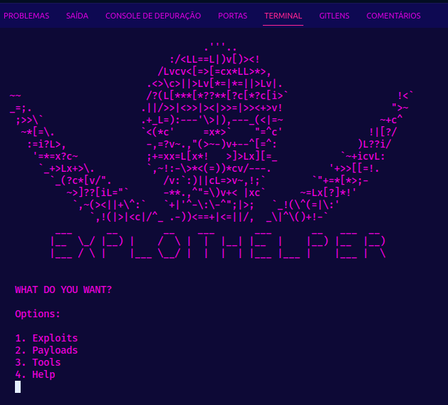

<h1> XploitHelper </h1>

<h2>
This tool is designed to store and organize my tools and codes used in pentesting."
</h2>
<br>

<h2> Installation</h2>

``` bash
$ git clone https://github.com/arisonreis/XploitHelper.git
$ cd XploitHelper
$ python3 ExploitHelper.py
```
<br>

<h2> Example</h2>

</img>